<h1 align="center"><a href="https://main.d2dbt9k4o6rj8o.amplifyapp.com/">AgroChain</a></h1>

<h3> Problem Statement</h3>

The United States Environmental Protection Agency (EPA) estimates that 10% of CO2 is emitted by the Agri sector. On one hand, Agri companies have sustainable products and services to offer to the growers. On the other hand, without proper economic incentives, farmers are reluctant to adopt sustainable practices. Centralized platform business models have so far not succeeded in creating economic value for the farmers, even while the demand for a voluntary carbon market is increasing. What technologies and business models can enable financially incentivizing farmers to implement climate-smart practices? What are the ways the buyer has proof of authenticity? In what ways the participants including investors can derive economic value?
	
<strong>ArgoChain </strong>is an NFT application Based on the Ethereum Blockchain written in Solidity Smart Contract, and using the power of React Frontend, and ether.js to interact with the Smart Contract present in the Ethereum Blockchain, a user can register as a Framer in the application, with all relevant information, Upload & Mint (In IPFs), buy and Sell NFT, in the ArgoChain NFT marketplace. The Industries then can buy those NFTs from market place granting them carbon credits and also investing money in farmers so that they can adopt more sustainable farming practices.

It provides a way for farmers to sell carbon credits in the form of NFT to industrial buyers who need to buy carbon credits to achieve sustainability goals, thus giving farmers money to invest in more sustainable farming practices, and a win-win situation for all, the Air Quality verification is done using IoT devices, thus acting as a verification mechanism to ensure, that money is invested by farmers to adopt more sustainable farming methods.

<b>Machine Learning Model, that can accurately predict the amount of carbon emission that can happen, from a field of 1 sq unit, based on the type of crop harvested, how much water is required, crop yield prediction, how well the irrigation is managed and other sustainable farming practices adopted, and based on it give the farmer a Carbon Score/credit that farmer can sell to the industry in exchange of Money/Crypto Currency </b>

##  Andromeda OS Migration

AgroChain has been successfully migrated to **Andromeda's Operating System (aOS)** to leverage cross-chain capabilities, modular smart contracts (ADOs), and AI-native infrastructure for enhanced carbon credit tokenization and trading.

### Key Migration Benefits
- **Cross-chain Carbon Credits**: Carbon credits can now be traded across multiple Cosmos chains
- **AI-Powered Carbon Scoring**: Enhanced machine learning for accurate carbon emission prediction
- **Modular Architecture**: Using Andromeda's ADO framework for composable smart contracts
- **Real World Asset Tokenization**: Carbon credits as RWAs with fractional ownership capabilities

### Andromeda OS Components
- **Smart Contracts → ADOs**: Replaced Solidity contracts with Andromeda Application-Specific Digital Objects
- **Ethereum → Cosmos**: Migrated from Ethereum to Cosmos ecosystem for cross-chain interoperability
- **Ethers.js → CosmJS**: Updated frontend to use CosmJS for Cosmos blockchain interaction
- **Hardhat → Andromeda CLI**: Switched to Andromeda's development tools

For detailed information about the Andromeda OS implementation, see the [Andromeda OS Documentation](./agrochain-aos/README.md).

## Features
- Farmer Registration.
- Mint NFT for Cabon Credits using Verification from IoT Data to prove sustainable farming practice is adopted.
- IoT Device data is Directly streamed to NFT for verification using Device ID and Azure IoT Hub.
- User Dashboard to view all the NFT Minted, sold, and Purchased.
- Customer/ Industries can buy NFT carbon credits to meet their ESG Goals and remain Carbon neutral companies.
- Money in the form of Cryptocurrency is directly transferred to farmers without commission and middlemen, so they can invest the money in adopting more sustainable farming methods.
- **Cross-chain Carbon Credit Trading** (Andromeda OS)
- **AI-Powered Carbon Scoring** (Andromeda OS)
- **Modular Smart Contract Architecture** (Andromeda OS)


## 1. Project Architecture

<p align="center">
  
</p>

### Andromeda OS Architecture

```
┌─────────────────┐    ┌─────────────────┐    ┌─────────────────┐
│   Frontend      │    │   Andromeda     │    │   AI Services   │
│   (React +      │◄──►│   aOS           │◄──►│   (Carbon       │
│   CosmJS)       │    │   (ADOs)        │    │   Prediction)   │
└─────────────────┘    └─────────────────┘    └─────────────────┘
         │                       │                       │
         ▼                       ▼                       ▼
┌─────────────────┐    ┌─────────────────┐    ┌─────────────────┐
│   Keplr Wallet  │    │   Cosmos Hub    │    │   IoT Devices   │
│   Integration   │    │   (Cross-chain) │    │   (Verification)│
└─────────────────┘    └─────────────────┘    └─────────────────┘
```

### 2. Clone/Download the Repository

```
git clone https://github.com/raj713335/Agrochain-Andromeda-OS
```

### 3. Run the .NET Backend Application (fetches the historical pollution data from a public API):

```
cd AgroChain/Rapyd.All
dotnet clean
dotnet build Agrochain.All.sln
cd Rapyd.API
dotnet watch run --Rapyd.API
```
<p align="center">
  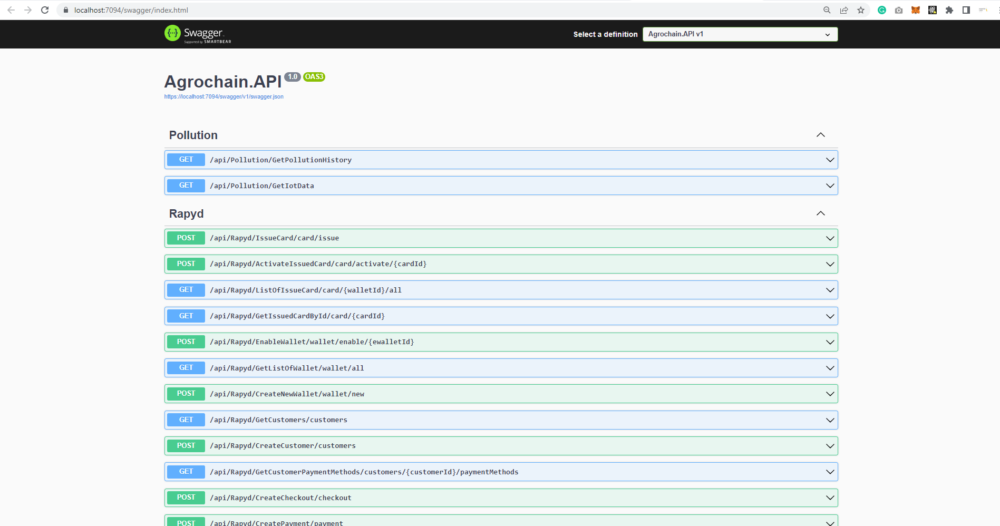
</p>

### 4. Install Node/React Dependencies:

```
cd AgroChain/agrochain
c:\windows\system32\cmd.exe /k "C:\Users\raj71\Downloads\node-v16.20.0-win-x86\nodevars.bat"
npm install
```

### 5. Boot up local Hardhat development blockchain

```
npx hardhat node
```

### 6. Connect development blockchain accounts to Metamask
- Copy the private key of the addresses and import it to Metamask
- Connect your metamask to hardhat blockchain, network 127.0.0.1:8545.
- If you have not added hardhat to the list of networks on your metamask, open up a browser, click the fox icon, then click the top center dropdown button that lists all the available networks then click add networks. A form should pop up. For the "Network Name" field enter "Hardhat". For the "New RPC URL" field enter "http://127.0.0.1:8545". For the chain ID enter "31337". Then click save. 

<p align="center">
  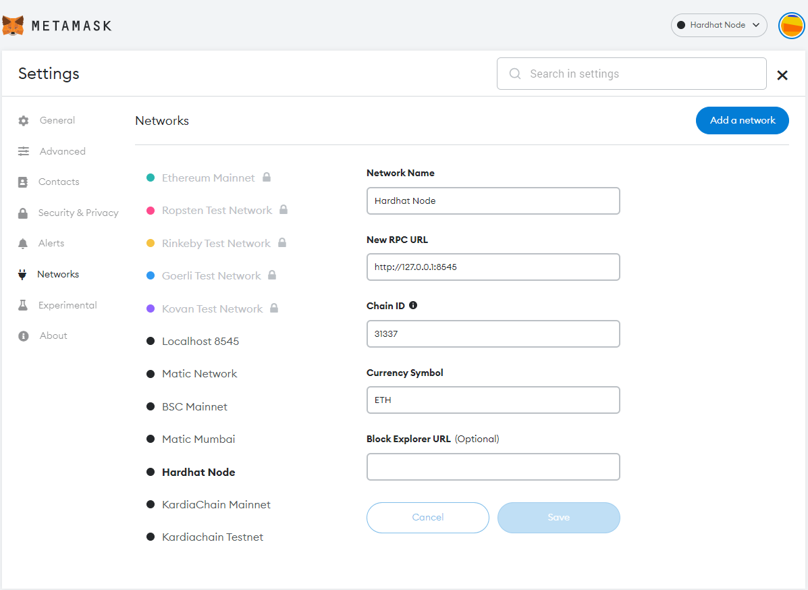
</p>

### 7(a). Migrate Smart Contracts
```
npx hardhat run src/backend/scripts/deploy.js --network localhost
```

### 7(b). Migrate Smart Contracts (Goerli Network)
```
npx hardhat run src/backend/scripts/deploy.js --network goerli
```

### 8. Run Tests
```
npx hardhat test
```

### 9. Launch Frontend
```
npm run start
```

##  Andromeda OS Setup (Alternative Implementation)

### Prerequisites for Andromeda OS
- Node.js 18+
- Andromeda CLI
- Keplr Wallet
- Go 1.19+ (for ADO compilation)

### Install Andromeda CLI
```bash
curl -sSfL https://raw.githubusercontent.com/andromedaprotocol/andromeda/main/scripts/install.sh | sh
```

### Setup Andromeda OS Components
```bash
cd agrochain-aos
npm install
andromeda config init
andromeda config set chain-id andromeda-1
andromeda config set rpc-url https://rpc.andromeda-1.andromeda.zone
```

### Deploy ADOs (Andromeda Digital Objects)
```bash
andromeda ado deploy --path ./ados/carbon-credit
andromeda ado deploy --path ./ados/marketplace
andromeda ado deploy --path ./ados/auction
```

### Start Andromeda OS Frontend
```bash
npm start
```

### 10. Project Architecture

<p align="center">
  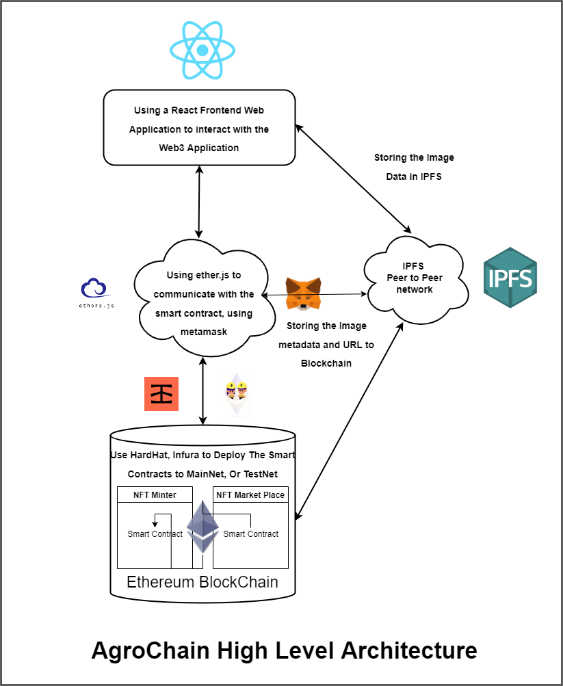
</p>

### 11. IOT Screenshots

<br />
<p align="center">
  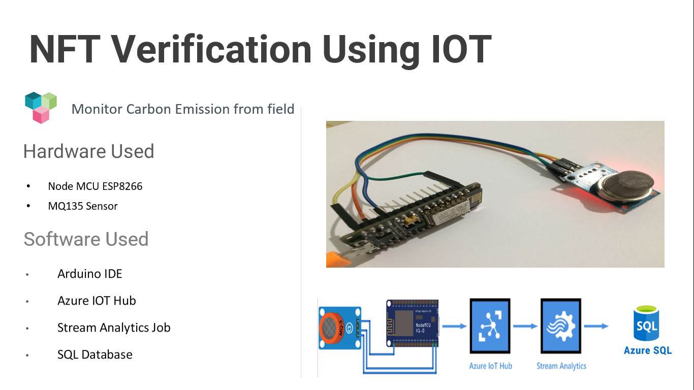
  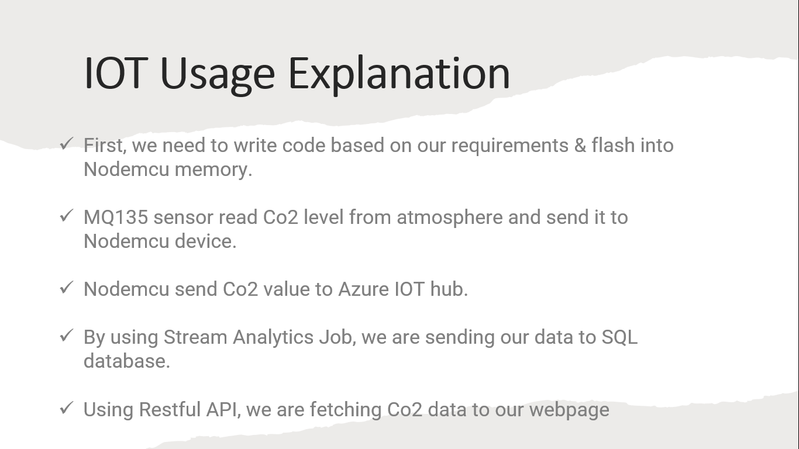
</p>
<br />

### 12. Application Screenshots

<br />
<p align="center">
  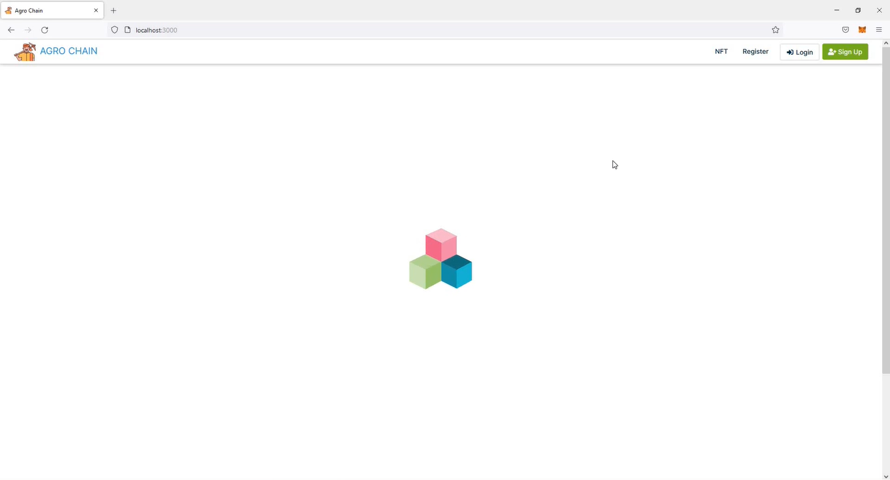
  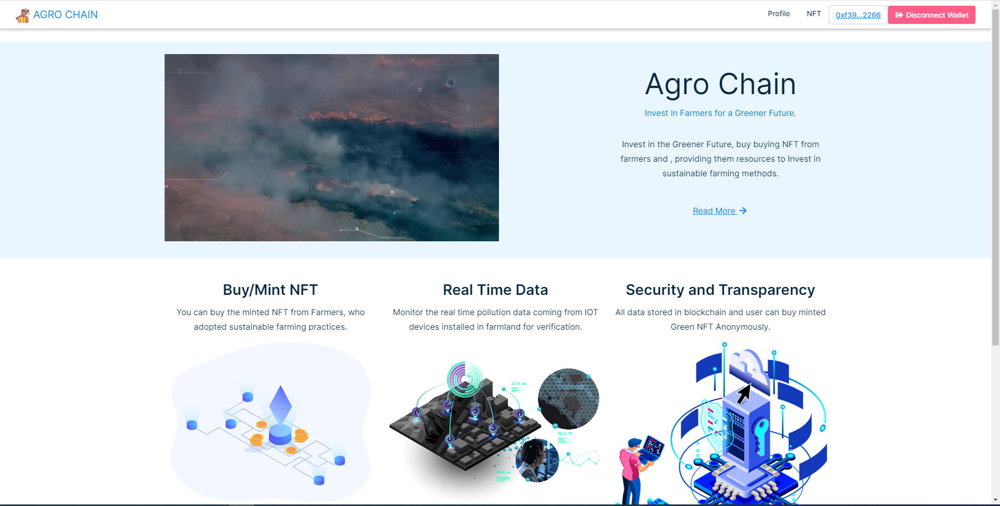
  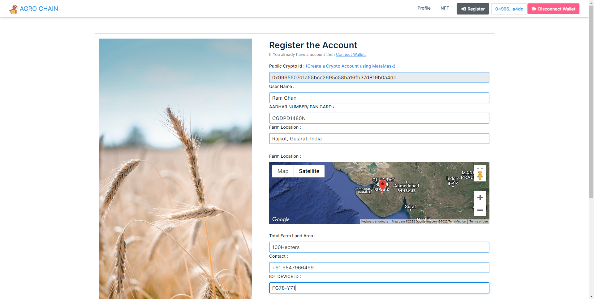
  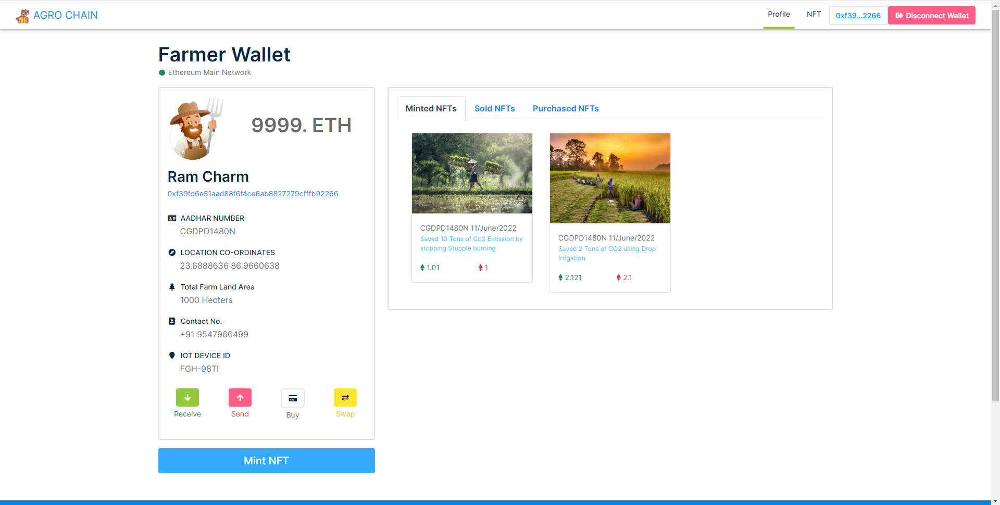
  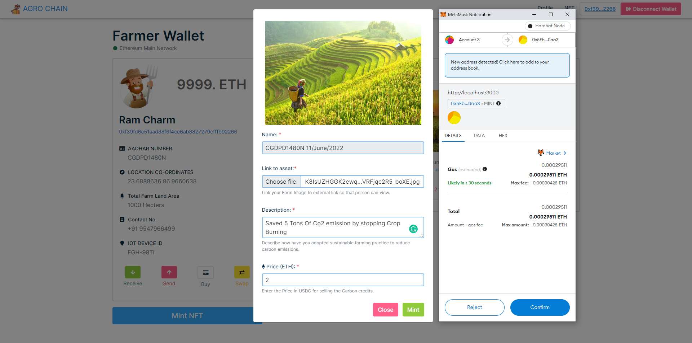
  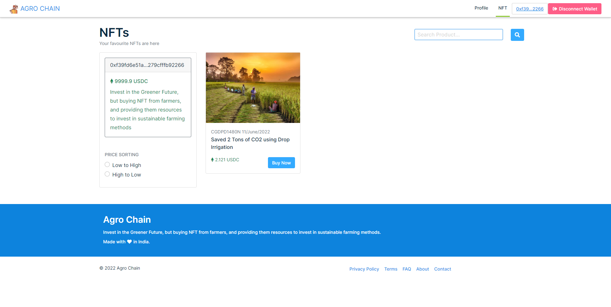
  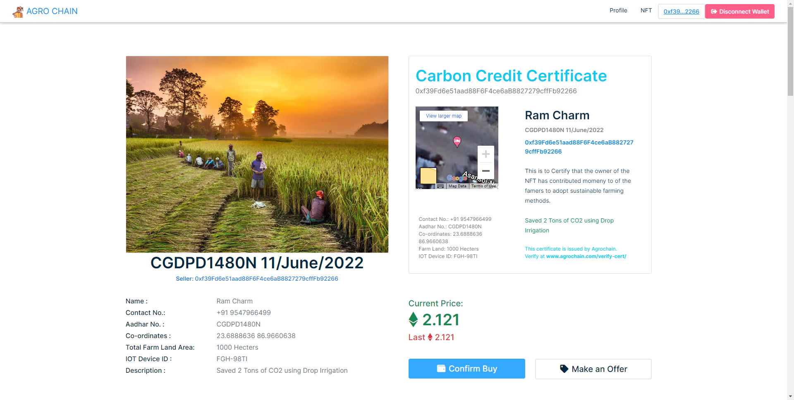
  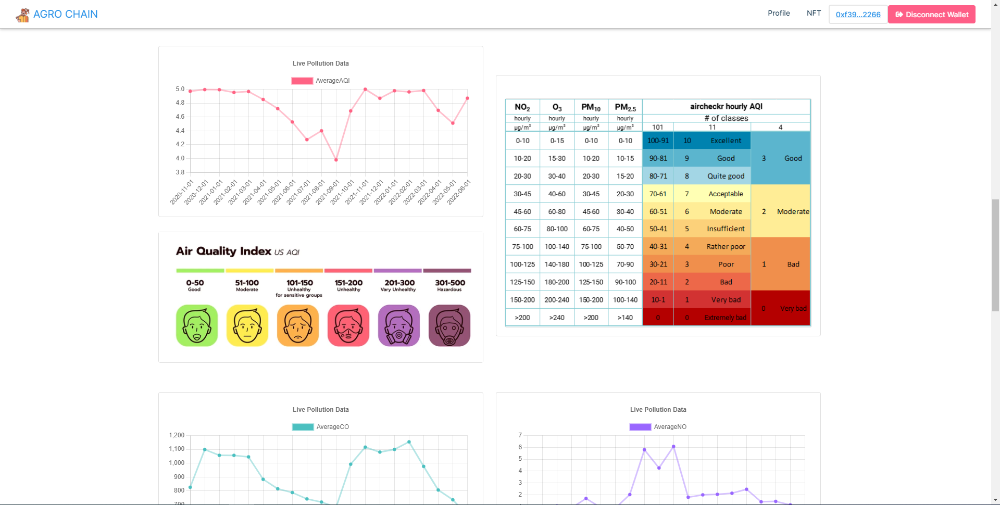
  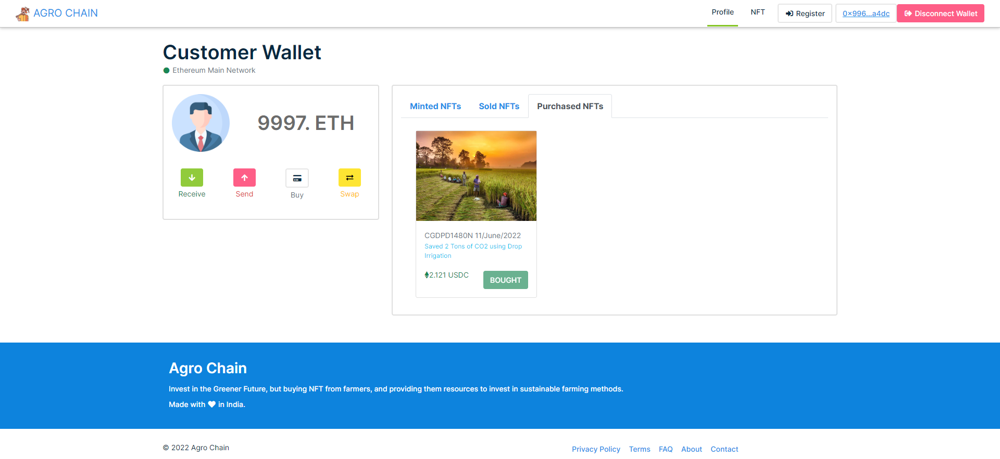
  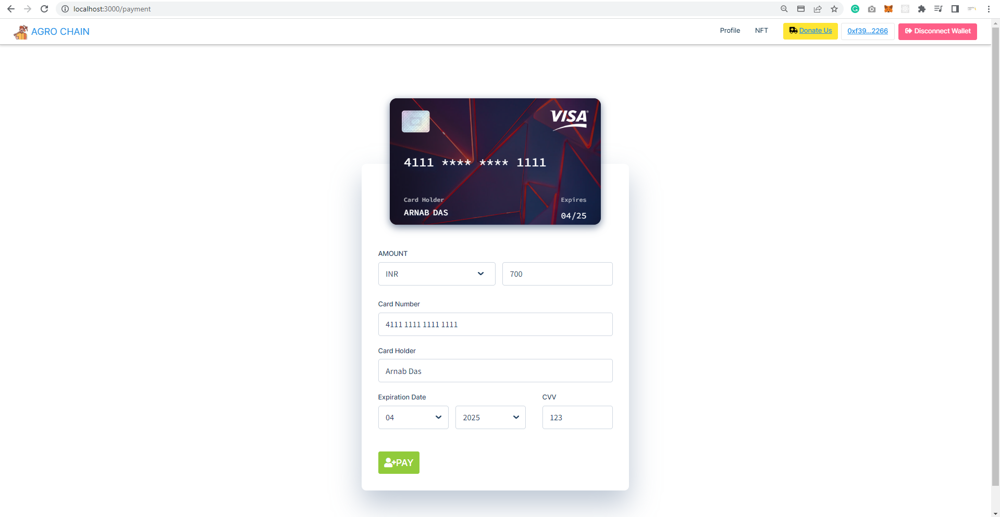
</p>
<br />

##  Documentation

- **Main Application**: This README
- **Andromeda OS Implementation**: [Andromeda OS Documentation](./agrochain-aos/README.md)
- **Smart Contracts**: [Ethereum Contracts](./agrochain/src/backend/contracts/)
- **ADOs (Andromeda)**: [Carbon Credit ADO](./agrochain-aos/ados/carbon-credit/src/)

##  Supported Networks

### Ethereum Implementation
- **Local Development**: Hardhat (localhost:8545)
- **Testnet**: Goerli
- **Mainnet**: Ethereum

### Andromeda OS Implementation
- **Testnet**: andromeda-testnet-1
- **Mainnet**: andromeda-1
- **Cross-chain**: Cosmos Hub, Osmosis, Juno, Evmos

##  Contributing

We welcome contributions to both the Ethereum and Andromeda OS implementations. Please see the respective documentation for contribution guidelines.

### Thank You


